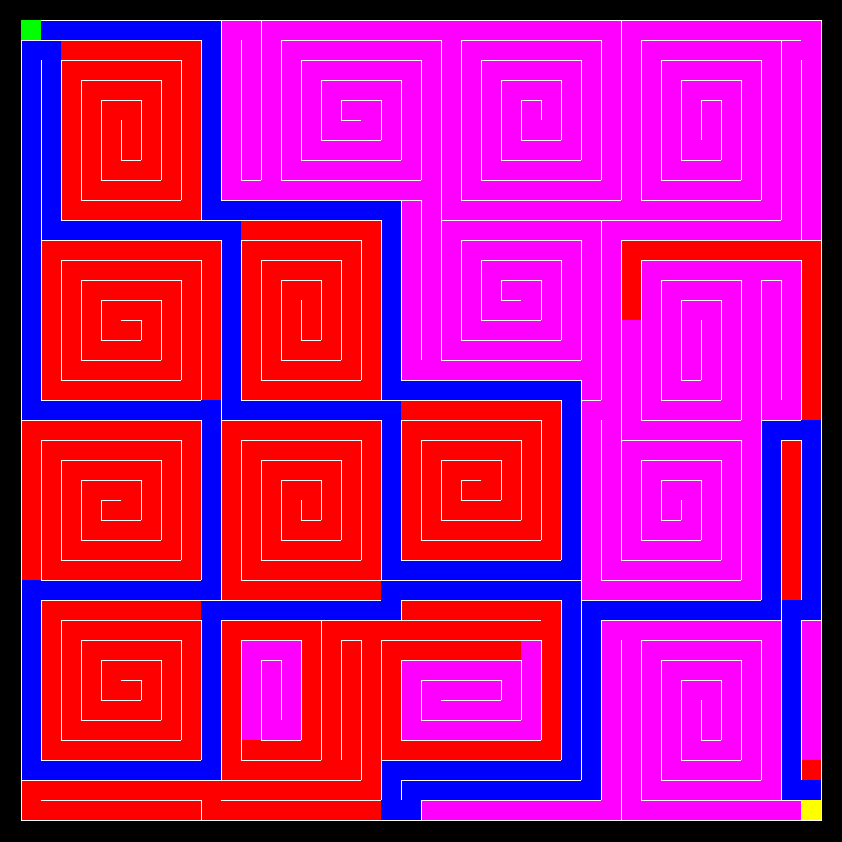

# PE1 23W Übungsprojekt "Java Maze Algorithms"

Dieses Projekt wird in den Übungen für PE1 im Wintersemester 2023/24 verwendet.
Es implementiert eine Vielzahl von Algorithmen, um ein Labyrinth zu generieren.
Zudem unterstützt es auch die Lösung des generierten Labyrinths.

## Marvin

